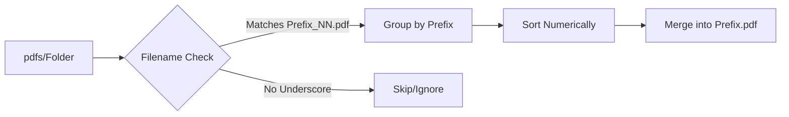

# PDF Document Merger 📄✂️

A lightweight Python utility to automatically group and merge PDF documents based on their filenames. Ideal for combining scanned pages or split reports.

---

## 📑 Table of Contents
- [Overview](#-overview)
- [How it Works](#-how-it-works)
- [Installation](#-installation)
- [Usage](#-usage)
- [File Naming Convention](#-file-naming-convention)
- [Examples](#-examples)
- [Troubleshooting](#-troubleshooting)

---

## 🔍 Overview
This script automates the tedious task of merging multiple PDF files. It's specifically designed for scenarios where you have sets of documents that belong together, distinguished by a numeric suffix.

### Key Features:
- **Smart Grouping**: Automatically identifies groups of files using prefixes.
- **Sequential Merging**: Merges files in alphabetical/numeric order.
- **Clean Output**: Generates a single PDF for each group, named after the group prefix.

---

## ⚙️ How it Works
The script scans a directory, identifies files following the `Prefix_Number.pdf` pattern, groups them by `Prefix`, and merges them into `Prefix.pdf`.



---

## 🚀 Installation

1. **Clone the repository**:
   ```bash
   git clone https://github.com/your-username/merging-pdfs-with-python.git
   cd merging-pdfs-with-python
   ```

2. **Install dependencies**:
   This project uses `pypdf`, a modern and robust PDF library.
   ```bash
   pip install -r requirements.txt
   ```

---

## 📂 File Naming Convention
To be correctly identified and merged, your files should follow this format:
`GroupName_Number.pdf`

| Input Filename | Group Name | Merged Output |
| :--- | :--- | :--- |
| `Invoice_01.pdf` | `Invoice` | `Invoice.pdf` |
| `Invoice_02.pdf` | `Invoice` | (Merged into Invoice.pdf) |
| `Report_2023_1.pdf` | `Report_2023` | `Report_2023.pdf` |
| `Single.pdf` | N/A | (Ignored) |

---

## 🛠 Usage

1. Place your PDF files in a folder named `pdfs/`.
2. Run the script:
   ```bash
   python pdf_merger.py
   ```
3. The merged PDF files will appear in the root directory.

---

## 📝 Examples

### Before Merging:
```text
pdfs/
├── ProjectA_01.pdf
├── ProjectA_02.pdf
├── ProjectB_1.pdf
└── ProjectB_2.pdf
```

### After Merging:
```text
.
├── ProjectA.pdf (Contains pages from 01 and 02)
├── ProjectB.pdf (Contains pages from 1 and 2)
└── pdfs/ ...
```

---

## 🎓 Exercises & Learning
Check out `exercise.py` for a template to build your own simple PDF merger! It's a great way to practice handling file systems and external libraries in Python.

---

## ❓ Troubleshooting

- **"No PDF files found"**: Ensure your files are in the `pdfs/` directory and have the `.pdf` extension.
- **Incorrect Order**: The script sorts files alphabetically. For numeric suffixes, use leading zeros (e.g., `_01`, `_02` ... `_10`) to ensure correct sorting beyond 9 files.
- **Underscore Issues**: The script splits by the *last* underscore. `My_Doc_01.pdf` will have the prefix `My_Doc`.

---
*Created with ❤️ for efficient document management.*
  


